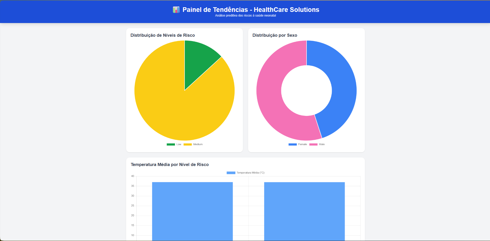

# IA DataView — HealthCare Solutions

Projeto de Data Science desenvolvido para a disciplina de Inteligência Artificial e Análise de Dados na Unifecaf.

O objetivo é analisar dados clínicos de recém-nascidos para identificar tendências de saúde e prever riscos potenciais usando técnicas de Machine Learning e visualização interativa.

---

## Descrição do Projeto

A HealthCare Solutions, uma rede de hospitais fictícia, busca aprimorar a qualidade do atendimento ao paciente por meio da análise de dados.

O sistema IA DataView foi desenvolvido para:

Processar e limpar grandes volumes de dados de pacientes;

Gerar insights a partir de métricas vitais e registros médicos;

Aplicar modelagem preditiva (IA supervisionada) para prever níveis de risco à saúde;

Exibir as tendências e previsões em um dashboard interativo baseado em web.

---

## Estrutura do Projeto

ia-dataview-unifecaf-python/
│

├── README.md

├── Relatorio.pdf

├── run.py

│

├── dashboard/

│   ├── data.json

│   ├── index.html

│   ├── run_server.py

│   ├── script.js

│   └── style.css

│

├── dataset/

│   ├── clean_input.py

│   ├── info.json

│   ├── organize_info.py

│   │

│   ├── input/

│   │   └── newborn_health_monitoring_with_risk.csv

│   │

│   └── output/

│       └── newborn_health_monitoring_with_risk.json

│

└── ia/

   ├── main.py

   ├── train.py

   └── weight/

   └── ── model.pkl

---

## Pipeline de Funcionamento

Leitura e limpeza dos dados
Os arquivos originais (como CSVs do Kaggle) são processados em dataset/clean_input.py e convertidos em JSONs estruturados por paciente.

Treinamento da IA (train.py)
O modelo supervisionado usa Random Forest para aprender padrões nos dados clínicos e prever o nível de risco do paciente.
Métricas como temperatura, saturação, frequência cardíaca e idade são usadas como entrada.

Previsão e geração de relatórios (main.py)
O modelo treinado é carregado e aplicado aos pacientes, gerando previsões de risco salvas em dashboard/data.json.

Visualização dos resultados (dashboard/run_server.py)
Um servidor Flask exibe os resultados no dashboard interativo, com gráficos criados em Chart.js e estilização via Tailwind CSS.

---

## Dashboard

O dashboard web exibe:

Distribuição de risco por paciente

Comparativo de temperatura média por nível de risco

Gráficos de risco por gênero (masculino/feminino, com pizza interativa)

Tendências e médias de indicadores clínicos

---

## Inteligência Artificial

Modelo: Random Forest Classifier

Bibliotecas: scikit-learn, pandas, numpy

Tarefas: Classificação do risco do paciente

Saída: Rótulos de risco (baixo, médio, alto) e tendências agrupadas

O modelo é salvo automaticamente em ia/weight/model.pkl e carregado pelo script main.py para novas previsões.

---

## Tecnologias Utilizadas
Categoria	Ferramentas
IA / ML	Scikit-learn, Pandas, Numpy
Backend	Flask
Frontend	HTML, Tailwind CSS, Chart.js
Visualização	Gráficos dinâmicos e comparativos
Dados	JSON, CSV (Kaggle Dataset)

---